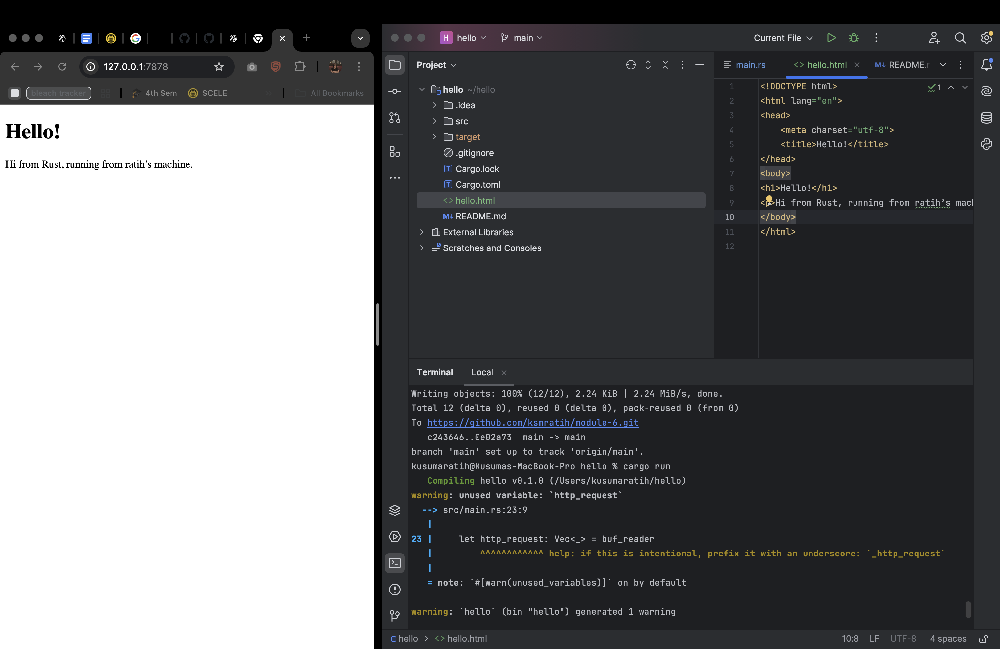

## Reflection 1

The handle_connection function is responsible for processing incoming TCP connections from a web client. It takes a mutable TcpStream as input, wraps it in a buffered reader to enable efficient line-by-line reading, and reduces system calls. The function reads the HTTP request by iterating through each line of the input stream, mapping the results to handle errors, and stopping at the first empty line, which marks the end of the request headers. Finally, it collects the request lines into a vector and prints them in a formatted output to the console for debugging.

## Reflection 2

We modified the handle_connection function to return an HTML response that can be rendered by a browser. Instead of just printing the HTTP request, the function now reads an hello.html file and constructs a proper HTTP response, including a status line (HTTP/1.1 200 OK) and a Content-Length header to indicate the size of the response body. This ensures the browser can correctly interpret and display the content. The response is then written to the TCP stream, allowing the browser to render the HTML page. This step helped in understanding how a basic web server serves static files and the importance of properly formatting HTTP responses.

## Reflection 3

We improved the server by validating incoming requests and selectively responding with the appropriate content. Instead of always returning hello.html, the server now checks the request path and returns either the correct page or a 404.html error page if the requested resource is not found. This approach mimics real-world web servers that handle different requests dynamically. Refactoring was necessary to separate request handling logic from response construction, making the code more modular and maintainable. This step reinforced the importance of structured request handling in web development.

## Reflection 4

We simulated a slow server response to observe the limitations of a single-threaded web server. When handling a request to /sleep, the server intentionally delays its response for 10 seconds using thread::sleep(). During this delay, the server becomes unresponsive to other requests, as it can only process one request at a time. This experiment highlights the inefficiency of single-threaded servers, especially under high traffic, as one slow request can block all others. This reinforces the need for concurrency and motivates the transition to a multithreaded server for improved performance.

## Reflection 5

We enhanced our server by implementing a thread pool to handle multiple client requests concurrently. Instead of processing requests sequentially, the server now assigns each incoming connection to a worker thread, allowing multiple requests to be handled in parallel. The ThreadPool struct manages a fixed number of worker threads, which pull tasks from a shared queue. This prevents a single slow request from blocking the entire server, significantly improving performance under load. By using Rust’s Arc<Mutex<T>>, we ensured safe shared access to the job queue while maintaining thread safety. This implementation highlights the benefits of multithreading in improving server responsiveness and scalability.
